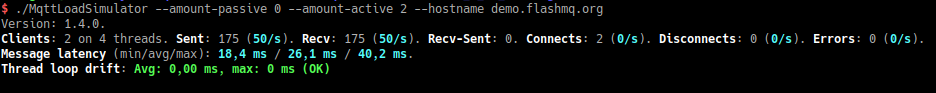

# MqttLoadSimulator

There are various MQTT stress testers out there, but they often give an inaccurate representation of server performance, because they don’t factor in their own performance limitations. It’s really hard to see when it’s the stress tester that is being overloaded, or the server. MqttLoadSimulator aims to allow better control of traffic generated and show its own performance:

# Features

* Hostname can be specified as comma-separated list, to allow testing millions of connections to one server, for which you need to give the server multiple addresses.
* Set number of active/passive clients
* Configure connection delay
* Set message burst size
* Set message burst rate
* Set QoS
* Set retain
* Set clean sessions / configurable session ID
* Configurable topic paths.
* Server TLS
* Client TLS
* Authentication with username/password
* Show latency stats

See `--help` for more details.

# Limitations

It uses the [QMQTT](https://github.com/emqx/qmqtt), which means it's limited to MQTT version 3, and doesn't have websocket support. An attempt has to be made to port it to [qtmqtt](https://github.com/qt/qtmqtt).

# Requirements

It requires that [QMQTT](https://github.com/emqx/qmqtt) is installed. The project has a `make install` option, which will install the Qt module in the directory of the Qt version you built it, like `~/Qt/5.12.4/gcc_64`.

# Download builds

Builds are provided on the FlashMQ website [here](https://www.flashmq.org/download/mqtt-load-simulator/).
